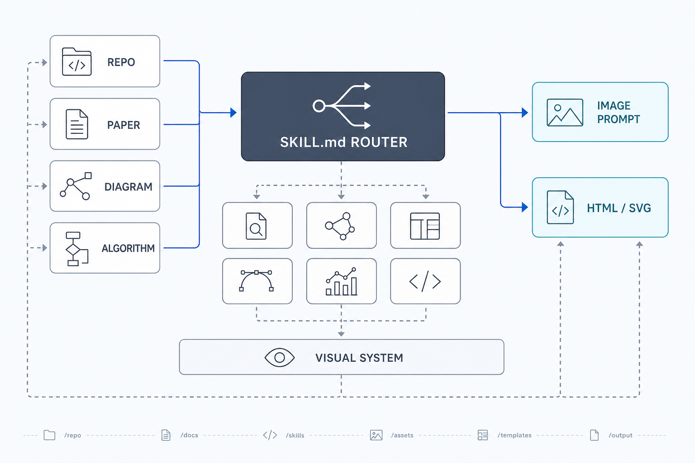

# FigureFoundry Skill Project

FigureFoundry is a source-to-scientific-figure planning skill for agents.
It converts codebases, papers, diagrams, algorithm descriptions, and design requests into
publication-quality figure plans, optimized image-generation prompt packages, and optional
editable HTML/SVG architecture artifacts.

The installed skill id is `figure-foundry`.



---

## What It Does

| Input | Output |
|-------|--------|
| Research paper (PDF or extracted text) | Paper figure prompt package, with citation/source coverage |
| Code repository / source files | Repo architecture figure prompt package, with source paths |
| Algorithm diagram (image) | Redesign/transposition prompt preserving visible structure |
| Algorithm description (text) | Algorithm/process figure prompt with assumptions separated |
| Mixed inputs | Unified prompt package with source authority and conflicts |
| Design request (no input) | Original architecture figure prompt with explicit assumptions |

Default output is a **FigureFoundry Prompt Package** that the user can paste into an
image-generation tool. If the user asks for deterministic labels, editable vector output,
HTML, or SVG, use the optional HTML/SVG renderer.

---

## Project Structure

```
FigureFoundry/
├── SKILL.md                    ← Master entry point + router
├── assets/
│   └── figurefoundry-simple-style.png
├── router/
│   └── intent_parser.md        ← Extended classification rules
├── skills/
│   ├── paper_to_poster.md      ← Research paper → editorial poster
│   ├── repo_analyzer.md        ← Code repo → architecture diagram
│   ├── diagram_to_draft.md     ← Diagram image → new architecture draft
│   ├── algo_to_draft.md        ← Algorithm text → architecture poster
│   ├── hybrid.md               ← Mixed input handler
│   └── design_from_scratch.md  ← Pure design generation
├── renderers/
│   ├── image_prompt.md         ← Default prompt package compiler
│   └── html_artifact.md        ← Optional HTML/SVG output engine
└── style/
    └── visual_system.md        ← Shared visual design system
```

---

## Visual Style

All outputs follow the **FigureFoundry editorial style**:
- Domain-aware scientific palettes selected from the source and figure claim
- Strong typographic hierarchy (large numbers dominate when useful)
- A single restrained accent for the primary path or main claim
- Corporate research report aesthetic (McKinsey × editorial data journalism)
- Inline SVG diagrams with consistent node/edge visual language
- A1 portrait proportions (800 × 1100px+ HTML)
- One strong hero visual supported by compact evidence panels

---

## Environment Support

**Prompt-first environments**
- Use uploaded files (PDF, images, text, zip) directly in chat
- Skill auto-detects input type and routes
- Output a copy-ready prompt package for image-generation tools

**Local coding environments**
- Run from inside or near a local repository
- Skill reads files with fast tools such as `rg --files` and `rg`
- Repo analysis uses manifests, entry points, imports, and config files as evidence
- Output prompt packages by default; save HTML/SVG only when requested

---

## How Routing Works

```
Input → SKILL.md router → classifies input type
      → reads sub-skill from skills/
      → reads style/visual_system.md
      → assembles content
      → reads selected renderer
      → generates prompt package or optional HTML/SVG artifact
```

The router uses signal scoring (see `router/intent_parser.md` for full rules). It detects
all strong input types first so mixed inputs route to `skills/hybrid.md` instead of being
prematurely classified as a single source.

---

## Installation

Copy the `FigureFoundry/` directory to your agent skills folder. For Codex-style skill
directories, the important entry point is:

```
FigureFoundry/SKILL.md
```

Package only the project files, not `.DS_Store`, build output, or local eval workspaces.

---

## Output Targets

### `image_prompt` (default)

Use when the user wants to call an image model themselves or did not explicitly ask for
editable vector output. Returns:
- Figure brief
- Core image prompt
- Layout specification
- Label priority list
- Style direction
- Negative prompt
- Recommended generation settings
- Post-edit notes
- Source discipline

### `html_artifact` (optional)

Use when the user asks for HTML, SVG, deterministic labels, editable vector output, or a
local artifact. Returns a self-contained HTML/SVG schematic following the same figure plan.

---

## Design Principles

1. **Narrative first** — every output tells a story, not just displays data
2. **Numbers dominate** — key statistics are visually dominant
3. **Labels over prose** — bullet labels, not paragraphs
4. **Diagram as argument** — the diagram proves the narrative claim
5. **One visual system** — all outputs feel like the same publication
6. **Evidence before inference** — unknowns and assumptions are visible
7. **Beautiful by constraint** — strong composition, restrained palette, precise alignment
8. **Prompt first, renderer optional** — source analysis and figure planning are separate from execution
