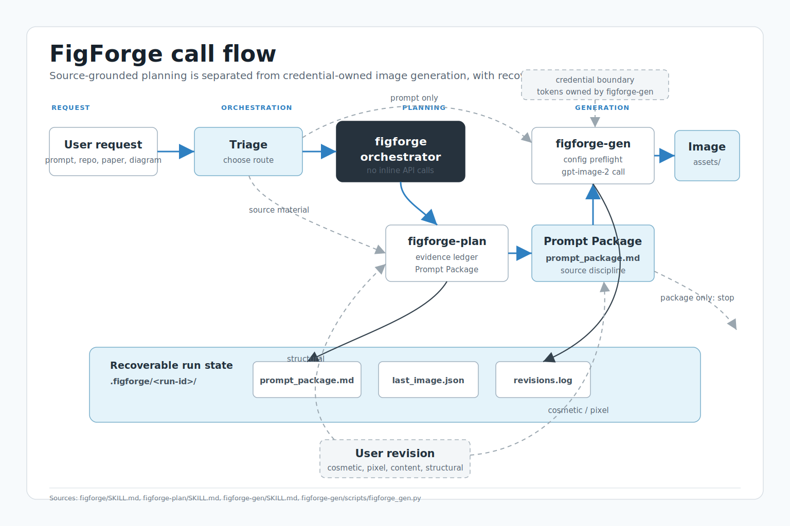

# FigForge

FigForge is a coordinator skill for turning source material into a generated scientific or technical figure. It keeps the workflow split into two explicit responsibilities:

- `figforge-plan` analyzes source material and produces a source-grounded Prompt Package.
- `figforge-gen` owns image API configuration, preflight checks, generation calls, and local image output.
- `figforge` routes between those layers and records state for later revisions.

## Call Flow



The normal full pipeline is:

1. A user request enters `figforge`.
2. `figforge` triages whether the request is a raw image prompt, source-backed figure work, or prompt-only planning.
3. Source-backed work is delegated to `figforge-plan`, which produces a Prompt Package with evidence, assumptions, unknowns, and recommended generation settings.
4. The Prompt Package is passed to `figforge-gen`, which performs config preflight and calls the image backend.
5. Run state is written under `.figforge/<run-id>/` so revisions can reuse the package, previous image, and revision log.

Revision routing stays explicit: cosmetic or pixel edits go back to `figforge-gen`, while structural changes go back through `figforge-plan`.

## Repository Layout

```text
figforge/
├── SKILL.md
├── README.md
└── assets/
    └── figforge-call-flow.svg
```

This repository contains the orchestrator. The worker skills live in sibling repositories:

- `figforge-plan`: source analysis and prompt-package construction.
- `figforge-gen`: gpt-image-2 generation, credentials, timeout rules, and output saving.
