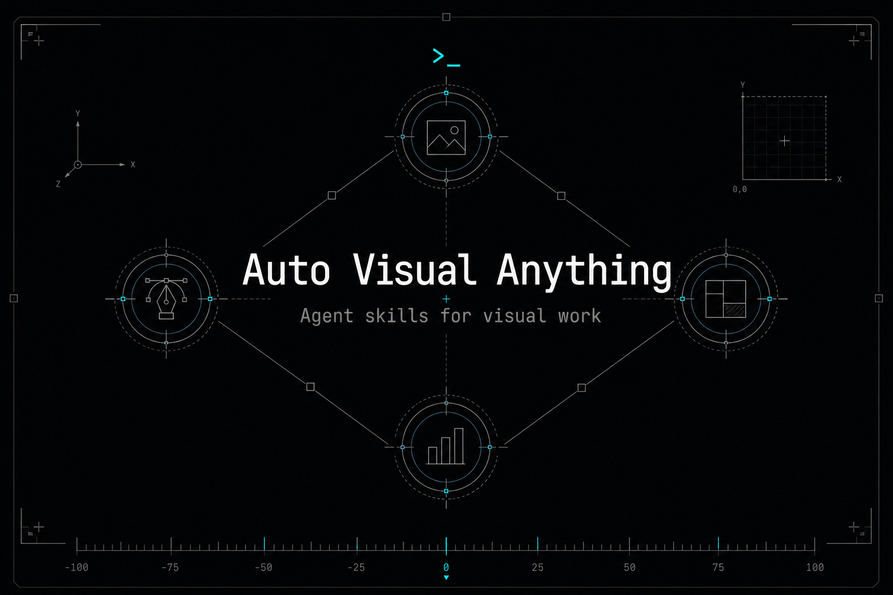
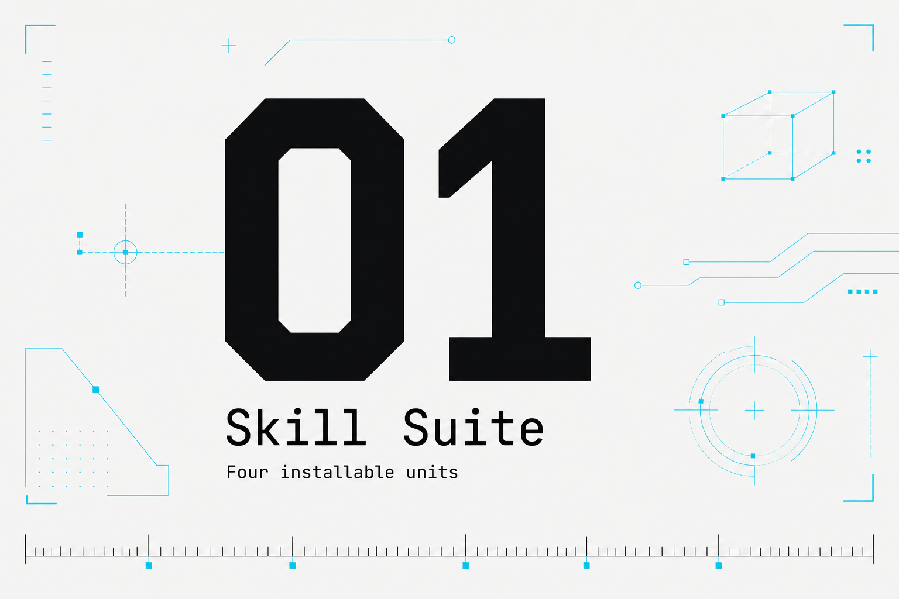
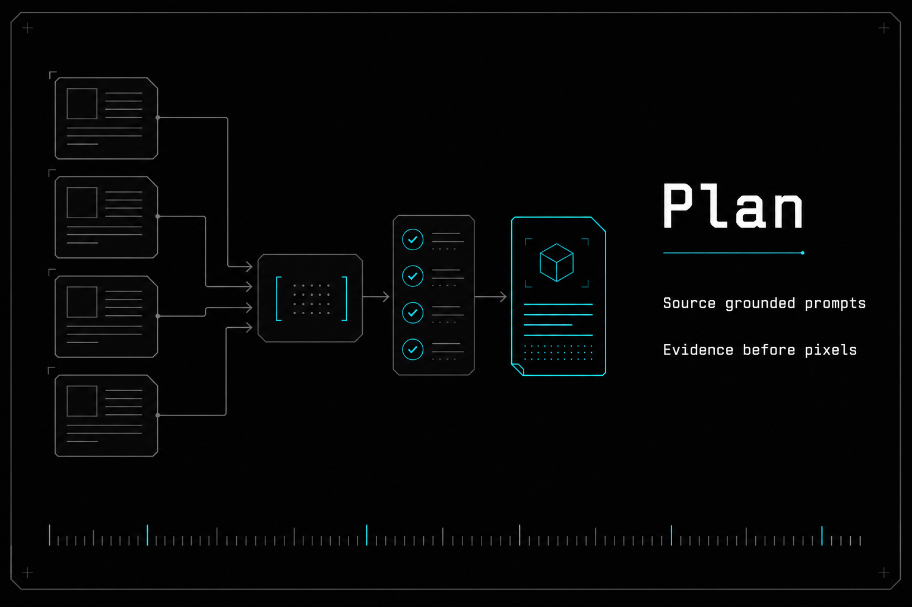
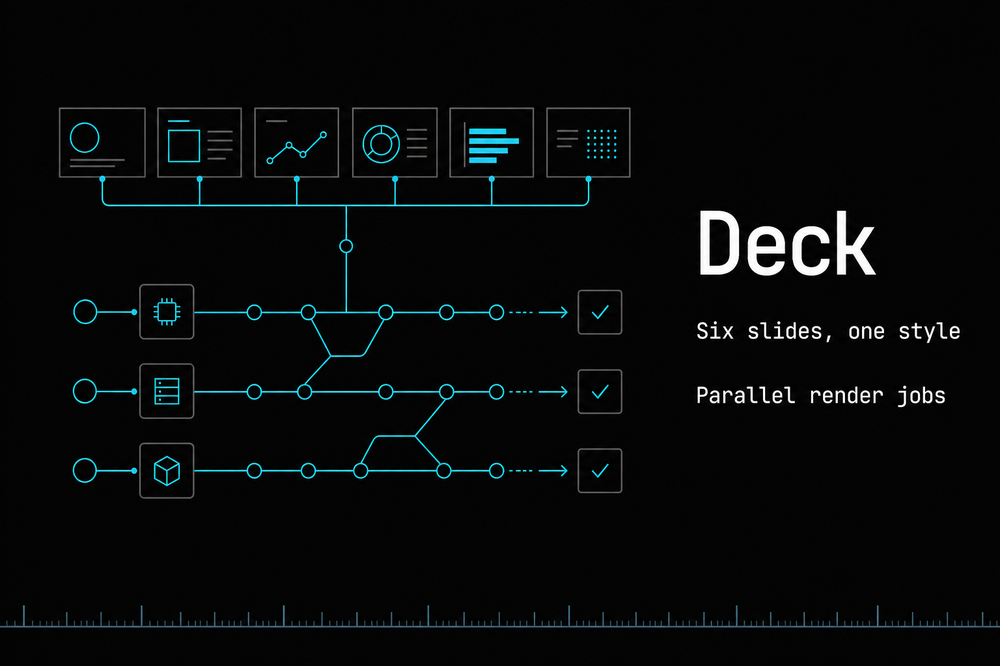
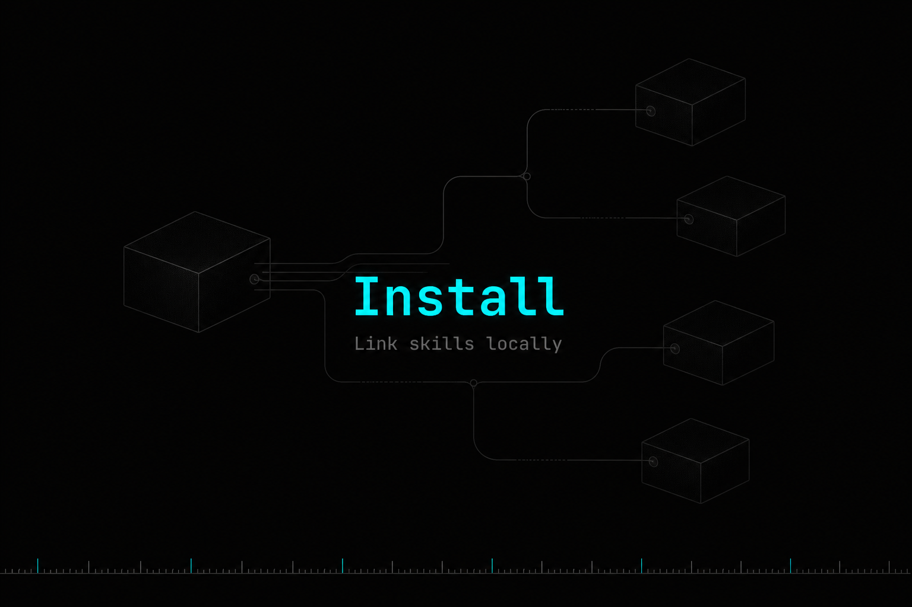

# Auto Visual Anything

Auto Visual Anything is a suite of installable agent skills for source-grounded figure
planning, image generation, and slide-image generation.

## Visual Overview

| | | |
| --- | --- | --- |
|  |  |  |
|  |  |  |

## Skills

| Skill | Role | Install unit |
| --- | --- | --- |
| `visual-anything` | Single-figure orchestrator: plan, generate, and iterate | `skills/visual-anything/` |
| `visual-plan` | Source-to-figure planning and prompt package generation | `skills/visual-plan/` |
| `visual-gen` | Image generation/editing through `gpt-image-2` compatible APIs | `skills/visual-gen/` |
| `visual-deck` | Multi-slide PNG deck orchestrator | `skills/visual-deck/` |

Each `skills/<name>/` directory is an install unit. Runtime instructions and
supporting files stay inside that directory; repo-root `docs/` and `contracts/`
are maintainer references only.

## Local Development

The recommended local setup is to keep this repository as the source of truth
and expose the individual skills through symlinks:

```bash
bash scripts/link-local.sh
```

This maps:

```text
~/.agents/skills/visual-anything      -> skills/visual-anything
~/.agents/skills/visual-plan          -> skills/visual-plan
~/.agents/skills/visual-gen           -> skills/visual-gen
~/.agents/skills/visual-deck          -> skills/visual-deck
```

Legacy aliases (`figforge`, `figforge-plan`, `figforge-gen`, `figforge-deck`)
may also point to these same directories during migration.

## Output Layout

Runtime outputs share one ignored root:

```text
.visual-anything/runs/
├── figure/<run-id>/   # visual-anything single-figure runs
├── deck/<run-id>/     # visual-deck slide-image runs
└── gen/<run-id>/      # direct visual-gen runs
```

Curated repository documentation images stay in `assets/` and can be committed
intentionally.

## Validation

Run:

```bash
bash scripts/validate.sh
```

The validator checks skill entry points, runtime dependency boundaries, deck
contracts, Python syntax, and `visual-gen` tests when `pytest` is available.
