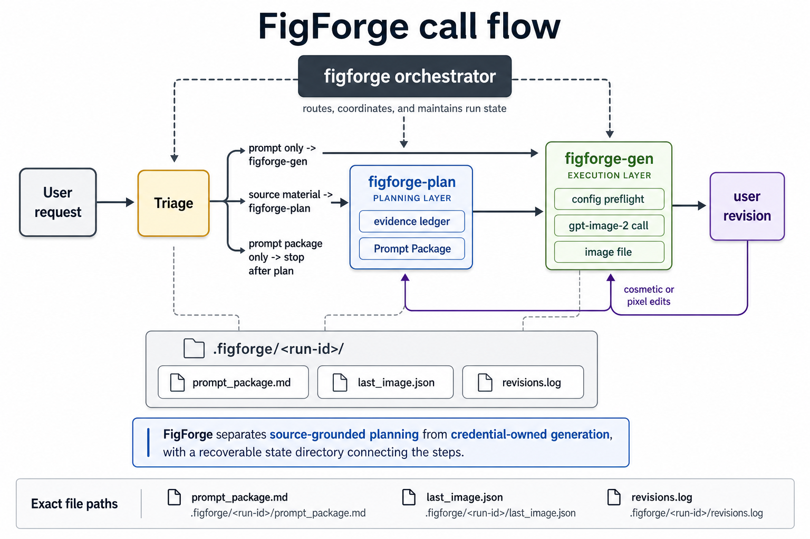

# visual-anything

> The single-figure orchestrator in Auto Visual Anything.
> It turns source material into a grounded figure plan and generated image.

[](https://github.com/Jianxinnn/auto-visual-anything/tree/main/skills/visual-anything)
[](https://github.com/Jianxinnn/auto-visual-anything/tree/main/skills/visual-plan)
[](https://github.com/Jianxinnn/auto-visual-anything/tree/main/skills/visual-gen)
[](https://github.com/Jianxinnn/auto-visual-anything/tree/main/skills/visual-deck)

`visual-anything` is the orchestrator skill in the family. It does not analyze source material itself, and it does not call image APIs itself. It routes between the two workers, persists run state, and decides where each revision belongs.

---

## The Family

| Skill | Responsibility | Repository |
|---|---|---|
| `visual-anything` | Triage incoming requests, route to plan / gen, persist run state, classify revisions | [skills/visual-anything](https://github.com/Jianxinnn/auto-visual-anything/tree/main/skills/visual-anything) |
| `visual-plan` | Read source material (paper / repo / code / diagram) and produce a source-grounded Prompt Package with an evidence ledger | [skills/visual-plan](https://github.com/Jianxinnn/auto-visual-anything/tree/main/skills/visual-plan) |
| `visual-gen` | Own image-API credentials, preflight, timeouts, and `gpt-image-2` calls; write images to disk | [skills/visual-gen](https://github.com/Jianxinnn/auto-visual-anything/tree/main/skills/visual-gen) |
| `visual-deck` | Produce a series of PPT-style slide PNGs with fixed style anchors | [skills/visual-deck](https://github.com/Jianxinnn/auto-visual-anything/tree/main/skills/visual-deck) |

The skills are independently useful. Use `visual-anything` when you want both
planning and generation in a single coherent loop for one figure. Use
`visual-deck` when the output is a multi-slide image series.

---

## Which one to call

| Request shape | Skill |
|---|---|
| "Make a main figure from this paper / repo, end to end" | `visual-anything` |
| "Read this source and produce a figure prompt — don't generate yet" | `visual-plan` |
| "I already have a finalized prompt; render the image" | `visual-gen` |
| "Generate a transparent-background cat" (no source material) | `visual-gen` |
| "Make a PPT-style image deck" | `visual-deck` |

If you are unsure, start with `visual-anything` — its triage step will route to the right worker.

---

## Pipeline



```
input ──► [visual-anything] triage
              │
              ├── source material  ──► visual-plan ──► Prompt Package
              │                                              │
              │                                              ▼
              └── prompt only      ──────────────────►  visual-gen ──► image
                                                              │
                                                              ▼
                                                         revision loop
```

1. **Triage** — `visual-anything` decides whether planning is needed.
2. **Plan** — `visual-plan` separates evidence from assumption from unknown, then compiles a Prompt Package.
3. **Generate** — `visual-gen` runs preflight, calls the image backend, and writes the image plus run metadata.
4. **Iterate** — cosmetic and pixel edits go back to `visual-gen`; structural edits go back to `visual-plan`. The orchestrator picks the lane and never silently regenerates from scratch.

Each run is recorded under:

```
.visual-anything/<YYYYMMDD-HHMMSS>/
├── prompt_package.md     # visual-plan output, verbatim
├── last_image.json       # { path, params, ts, prompt_package }
└── revisions.log         # one line per revision attempt
```

---

## Why split the skills

- **Credential isolation.** API tokens live only inside `visual-gen`. The orchestrator never reads, copies, or forwards them.
- **Truthfulness contract.** `visual-plan` is the only layer permitted to judge whether evidence is sufficient. `visual-anything` will not bypass it to feed a thin prompt into generation.
- **No reimplementation.** The orchestrator invokes sub-skills through their public entry points; it does not call their internal scripts. A change inside `visual-gen` (timeout policy, model selection, output format) does not require touching `visual-anything`.

---

## Repository layout

```text
visual-anything/
├── SKILL.md                    # orchestration rules (triage / plan / generate / iterate)
├── README.md
└── assets/
    ├── visual-anything-call-flow.png
    └── visual-anything-call-flow.svg
```

This install unit contains only the single-figure orchestrator. Worker code lives in:

- **Planning** — `../visual-plan`
- **Generation** — `../visual-gen`
- **Slide-image decks** — `../visual-deck`

---

## See also

- `SKILL.md` in this repo — full orchestration logic, including triage signals, revision classification, and state file shapes.
- `visual-plan/SKILL.md` — Prompt Package structure and the evidence ledger.
- `visual-gen/SKILL.md` — credential resolution order, preflight checks, and CLI arguments.
